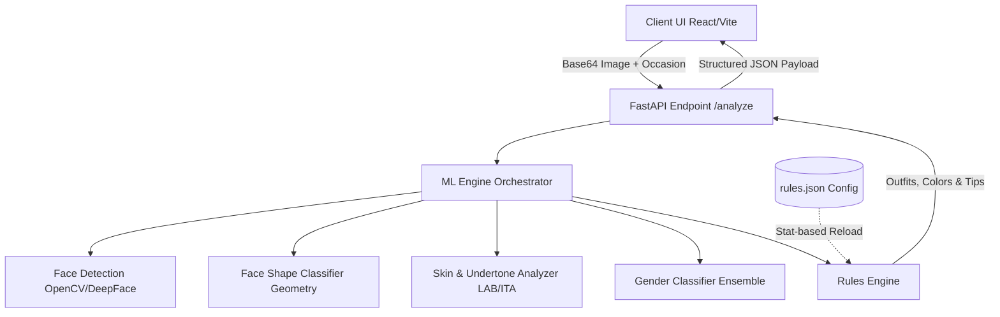

# FaceTheory // AI Personal Stylist 🔍🎨

> **Clinical Biometric Analysis meets Algorithmic Personal Styling.**
> An Insoftex-inspired styling application that analyzes facial geometry, skin tone metrics, and undertones to deliver personalized wardrobe curation.

---

## 🚀 Key Features

*   **📐 Real-time Facial Geometry Analysis**: Classifies face shape (Oval, Round, Square, Oblong, Heart) using scale-invariant horizontal width projections at forehead ($20\%$), cheek ($50\%$), and jaw ($78\%$) levels.
*   **🧪 ITA Skin Tone & Undertone Telemetry**: Converts masked skin pixels to CIELAB space to calculate the **Individual Typology Angle (ITA)** for objective skin category mapping. Calculates red-to-blue hue balances to classify Warm, Cool, or Neutral undertones.
*   **🧔 Beard-Aware Gender Classifier**: Employs an ensemble model (DeepFace VGG-Face $\rightarrow$ Levi-Hassner Caffemodel) combined with an OpenCV Laplacian Chin-to-Cheek micro-texture analyzer to detect beards and override default DNN predictions.
*   **⚡ Hot-Reloadable Suggestion Engine**: Suggestions are kept decoupled from code in [rules.json](ml/recommendation/rules.json). Modifying wardrobe or color suggestions applies instantly to active client sessions without requiring a backend restart.
*   **💻 Insoftex Clinic UI**: Premium warm neutral glassmorphic client interface containing custom widgets:
    *   **2D Contrast & Gender Matrix**: A quadrant graph mapping biometrics.
    *   **Facial Thirds HUD**: Range-slider metrics representing proportional facial divisions.
    *   **Color Suitability Scores**: Suitability metrics with visible custom progress indicators.
    *   **Seasonal Swatch Decks & Closet Matcher**: Clothes recommendations mapping direct buying links on Amazon, Flipkart, and Meesho.

---

## 🛠️ Tech Stack

*   **Frontend**: React (Vite), TailwindCSS, Lucide Icons, HTML5 Canvas/Webcam.
*   **Backend**: Python, FastAPI, Uvicorn, Pydantic (data validation).
*   **Computer Vision**: OpenCV (`cv2`), NumPy, DeepFace (ArcFace/VGG-Face backends).

---

## 📐 Architecture Flow



---

## ⚙️ Setup & Installation

### 🐳 Option A: Running with Docker (Quickest)

```bash
docker-compose up --build
```
*   **Vite Frontend**: [http://localhost:5173](http://localhost:5173)
*   **FastAPI Backend & API Docs**: [http://localhost:8000/docs](http://localhost:8000/docs)

---

### 💻 Option B: Local Manual Setup

#### 1. Backend Setup
Navigate to the root directory, create a virtual environment, and install dependencies:
```bash
# Set up Python virtual environment
python -m venv .venv
source .venv/bin/activate

# Install requirements
pip install -r backend/requirements.txt
```

Launch the FastAPI backend server:
```bash
uvicorn backend.main:app --reload --host 0.0.0.0 --port 8000
```

#### 2. Frontend Setup
Open a separate terminal window, navigate to `frontend/`, install dependencies, and start the development server:
```bash
cd frontend
npm install
npm run dev
```

---

## ⚙️ Editing Recommendation Rules

You can edit wardrobe clothing items, suitability colors, or tips at any time inside [ml/recommendation/rules.json](ml/recommendation/rules.json). 

For example, update the `Male-Oval-Casual` wardrobe array:
```json
"Male": {
  "Oval": {
    "Casual": [
      "Custom Outfit Suggestion Here",
      ...
    ]
  }
}
```
*The FastAPI backend tracks the file's modification timestamp (`mtime`) and automatically updates in-memory dictionaries upon the next API call, providing instant feedback in the UI without server restarts.*
